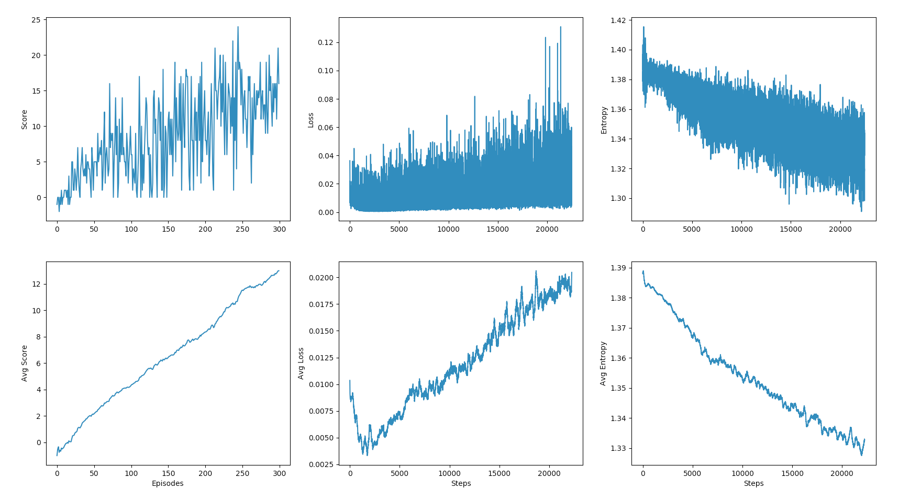

This details the methodology used in evaluating and improving agent learning performance.

#### Agent
Here's what the agent looks like after training:

#### Algorithm
This agent implements the Deep Q Network (DQN) algorithm.  DQN combines off-policy training and bootstrapping from traditional Q-learning with function approximation using neural networks.  This makes if very effective at learning even in high dimensional continuous state spaces.  However this combination, referred to as the "Deadly Triad" by Richard Sutton, is known to have divergence issues where the agent does not converge on a policy but instead oscillates all over the place.

To mitigate this, DQN also employs a couple modifications including Experience Replay and Fixed Q-targets.  Experience replay is a finite memory buffer of past experiences that the agent can sample from during learning.  Fixed-Q targets use a second neural network with weights that do not change as quickly as the online network and is used when calculating the TD target.   Both of these help stabilize converge but do not guarantee it.  More details are available in the original DQN [paper](https://deepmind.com/research/dqn/).

#### DQN enhancements
Since the DQN algorithm first came out several enhancements have been proposed.  A couple of those enhancements have been tried here including [Double DQN](https://arxiv.org/abs/1509.06461) and [Dueling networks](https://arxiv.org/abs/1511.06581).

Double DQN leverages both the online network and the target network when calculating the predicted Q values in an effort to reduce overoptimistic estimations.
Dueling networks separate estimation of the state value from the state dependent action advantage to better determine state value without having to explore all the associated actions.

All four combinations were [tested](detailed_results.md) and results are shown below.  The results are the average number of episodes required to solve the environment over three different seeds.  The criteria for solving is considered to be an average score of +13 over 100 consecutive episodes.

|                  | DQN    |  Double DQN |
|------------------|--------|-------------|
| Standard Network | 192.3  | 246.6       |
| Dueling Network  | 247.6  | 290         |

Surprisingly it is clear that vanilla DQN, without any of the enhancements, is the best algorithm for this environment.  This may be due to the fact that Double DQN and Dueling Networks had the least impact amongst a variety of enhancements that were brought together in [Rainbow DQN](https://arxiv.org/abs/1710.02298).

#### Neural network model
The neural network model maps the state (input) to actions (output).  It consists of a two fully connected hidden layers, each with 32 nodes and using relu activation.  Networks with one, two and three hidden layers were all tested and two was found to work best.  The number of nodes in the hidden layers was tried with 16, 32 and 64, and 32 was found to work best.

#### Epsilon
Tweaking epsilon was the other hyperparameter that was found to improve learning speed.  An aggressive epsilon decay rate of 0.97 and a lower bound on epsilon of 0.001 both helped decrease the time needed to solve the environment.

#### Metrics
See the graphs below for an example of a typical training run.  There are three pairs of graphs: reward, loss and entropy.

- Score (reward) can be seen to be consistently increasing over time.  This is the best indication that the agent is learning.
- Loss is increasing over time due to the policy constantly changing.  This is fairly typical with DQN, if training is run long enough loss should decrease again.
- Entropy is decreasing over time.  Entropy is a measure of how certain the agent is of its predictions.  Ideally entropy decreases as rewards increase.

Results vary depending on the seed but typically the agent is able to solve the environment in 150 - 250 episodes.

#### Future enhancements
There are plenty more things could be tried to further improve performance, such as:

- Some of the more effective DQN modification cited in the Rainbow DQN paper, like Prioritized Experience Replay and Multi-step Learning.
- A more systematic exploration of the various hyperparameters, especially the different combinations of neural network models and epsilon decay.
- Trying different loss functions, optimizers and learning rate.
